# Java vs Rust Kafka clients: a benchmark

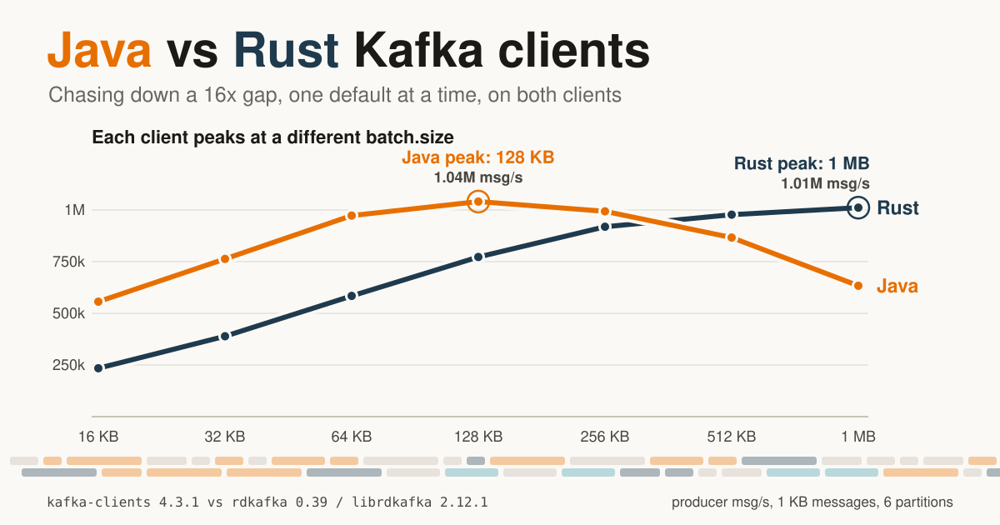

This repository benchmarks the Java Kafka client (`org.apache.kafka:kafka-clients` 4.3.1, Temurin 25) against the Rust client (`rdkafka` 0.39.0, bundling librdkafka 2.12.1). Both run on the same hardware, against the same single Kafka 4.3.1 broker, with byte-identical payloads. Everything runs in Docker on the Docker host of the active context (an EC2 c6i.8xlarge in the reference runs). The local machine is only a `docker` CLI client.

- The story, with every step: [Java vs Rust Kafka Clients: Chasing Down the Gaps](https://yashladha.in/blog/java-vs-rust-kafka-client-performance/)
- The full analysis: [`docs/ANALYSIS.md`](docs/ANALYSIS.md), with the diagnoses in [`docs/diagnosis.md`](docs/diagnosis.md) (Rust) and [`docs/java-diagnosis.md`](docs/java-diagnosis.md) (Java)
- The fairness specification both harnesses implement: [`CONTRACT.md`](CONTRACT.md)

## Results at a glance

Each client tuned, 1 KB messages, 6 partitions, one client instance, medians of 3 reps unless noted.

| | Java | Rust |
|---|---|---|
| Producer, each client at its best `batch.size` | 1.05M msg/s (1.12M with `send.buffer.bytes=-1`, single run) | 1.00M msg/s |
| Producer, each client at its library defaults | 561k msg/s | 1.00M msg/s |
| Consumer, 1 KB | 1.21M msg/s | 1.35M msg/s |
| Consumer, 10 KB | 137k msg/s | 305k msg/s |
| Consumer, 100 B | 5.75M msg/s | 2.10M msg/s |
| End-to-end p99, 1k msg/s, `linger.ms=0` | 0.39 ms | 0.20 ms |
| End-to-end p99, 50k msg/s, `linger.ms=0` | 0.93 ms | 1.93 ms with `max.in.flight=5`, 32.9 ms with librdkafka defaults |
| Peak RSS | about 2.4 GB (pre-touched 2 GiB heap) | 9 MB to 1.2 GB |
| Startup to ready | 260 ms | 0.8 ms |

Rust consumer numbers use the tuned consumer (`rust-tuned`: batch API and `fetch.queue.backoff.ms=10`).

## The story in charts

### The test bench

Broker, orchestrator and clients run in separate containers pinned to separate cores of one host.

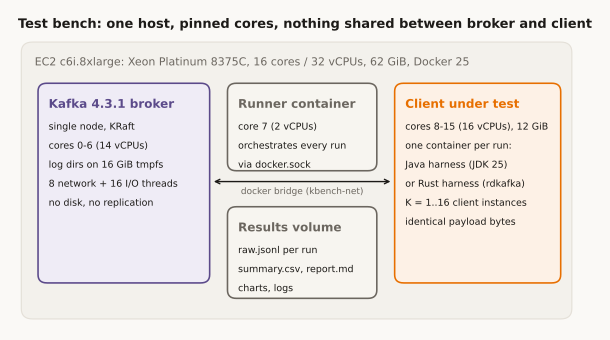

### First run: Rust behind almost everywhere

With every setting mapped one to one to Java's, Rust trailed in most scenarios: 0.43x on the producer baseline and 0.06x on 100 B consumption, but 2.14x on 10 KB consumption.

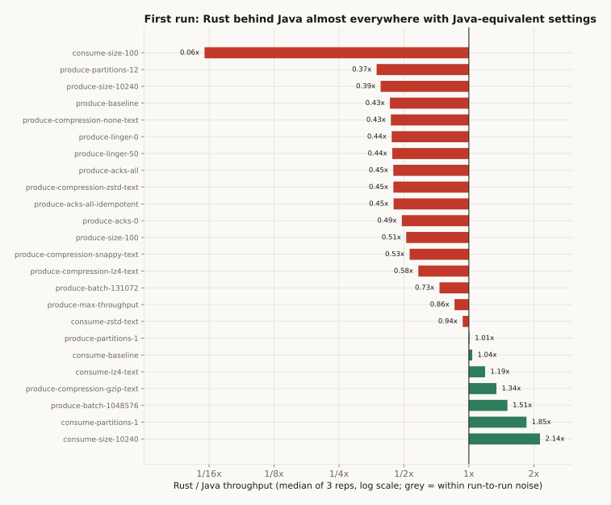

### Gap 1: the Rust producer is bound by bytes per request

librdkafka puts one partition's batch in each ProduceRequest, and the broker serves one connection's requests in order. At Java's 16 KB `batch.size` that caps Rust at about 245k msg/s. librdkafka's own default is 1 MB, where Rust reaches about 1M msg/s.

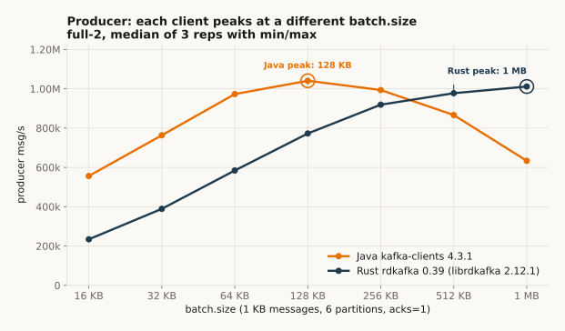

### Gap 2: the Rust consumer pauses for a second

When a partition's local queue fills, librdkafka stops fetching it for `fetch.queue.backoff.ms`, 1000 ms by default. At 100 B that queue fills in milliseconds. A 10 ms backoff and the batch API take Rust from 389k to 2.02M msg/s.

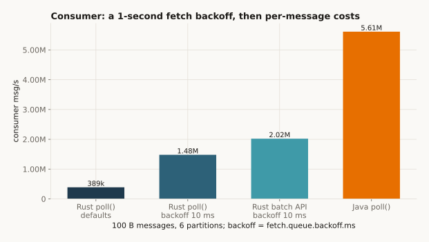

### The rerun: where the gaps went

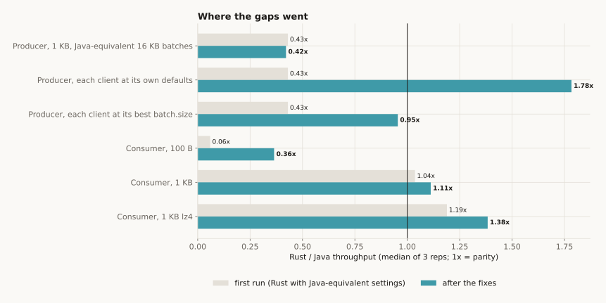

### Gap 3: the Java side

Java's slow spots had causes of their own. Its fixed 128 KB socket send buffer makes large requests expensive, because the JDK re-copies the unsent part of a heap buffer on every partial write; `send.buffer.bytes=-1` lifts the 1 MB point from 630k to 875k msg/s.

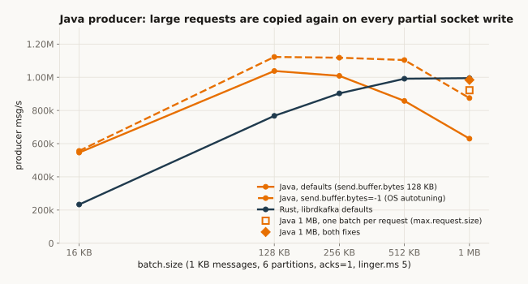

A single `KafkaConsumer` does all socket reads, parsing and copying on the polling thread, which runs at about one core. `receive.buffer.bytes=-1` adds 16 to 17%.

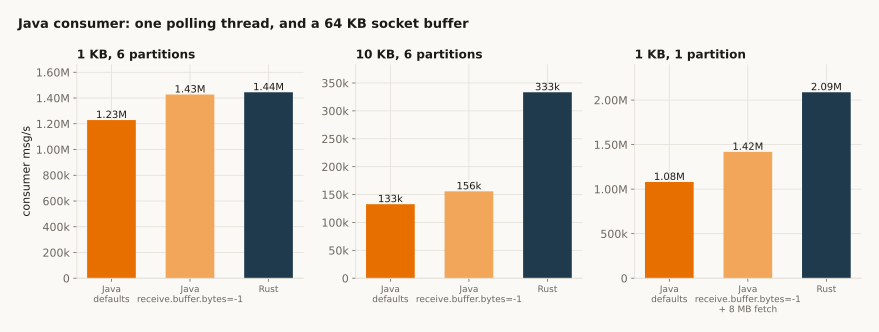

With 16 producer instances in one JVM, queued records fill the 2 GB heap and GC collapses. Capping `buffer.memory` recovers most of the throughput.

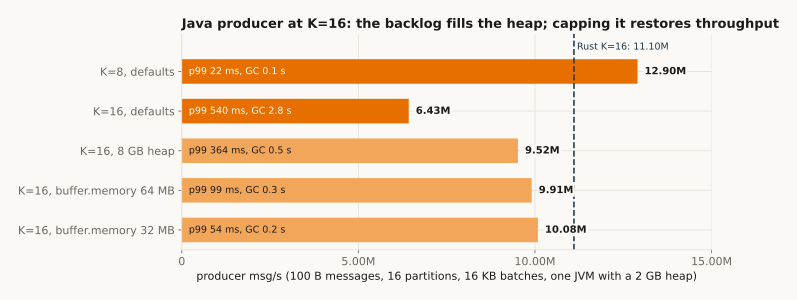

### Latency: one knob matters

librdkafka's default `max.in.flight` of 1,000,000 costs about 20x at p99 when `linger.ms=0` and the rate is high. Setting it to 5 brings Rust back next to Java.

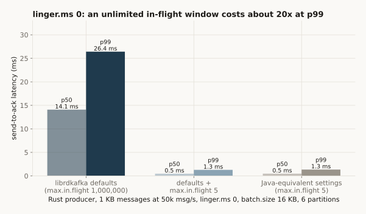

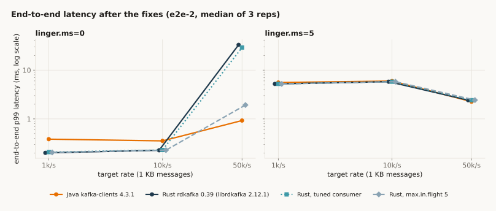

### Scaling and cost

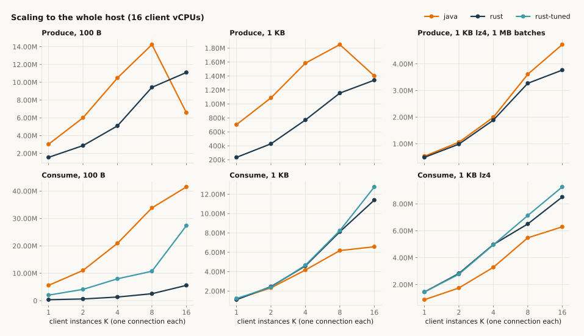

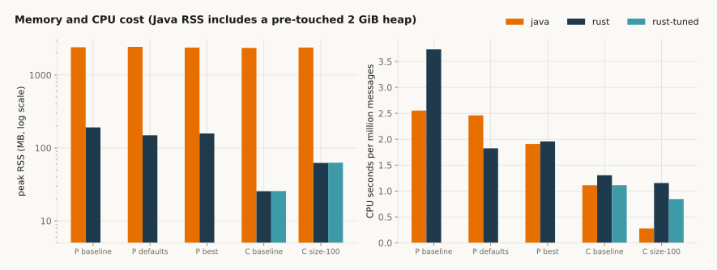

All charts are in [`docs/images/`](docs/images/) and are generated by `bench/story_plots.py` and `bench/hero_svg.py` (see [Charts for the write-up](#charts-for-the-write-up)).

## Layout

| Path | Contents |
|---|---|
| `java-bench/` | Java harness, image `kbench-java:latest` |
| `rust-bench/` | Rust harness, image `kbench-rust:latest` |
| `infra/` | Broker compose file (`kbench-kafka` on `kbench-net`), topic, broker-stats, host-info and stock perf-test scripts |
| `bench/` | Orchestrator (`run.py`), scenario matrix (`matrix.py`), report generator (`report.py`), fake-data generator (`fake.py`), write-up charts (`story_plots.py`, `hero_svg.py`) |
| `docs/` | Full analysis (`ANALYSIS.md`), Rust and Java diagnoses (`diagnosis.md`, `java-diagnosis.md`), charts (`images/`) |
| `runner/` | Image `kbench-runner:latest` that runs the orchestrator and report on the Docker host |
| `kbench.sh` | Launcher; uses only `docker` commands |

## Prerequisites

- `docker` CLI with the active context pointing at the benchmark host (`docker context use <your-context>`).
- Nothing else locally. Builds, runs, analysis and charts all happen in containers on that host.

## Running a benchmark

```
./kbench.sh build                 # build kbench-java, kbench-rust, kbench-runner on the Docker host
./kbench.sh run --dry-run         # print the plan, run count and ETA without running anything
./kbench.sh run --reps 3 --out full-1
```

`run` starts the `kbench-runner` container detached (`docker run -d`) on the Docker host, so the local machine can sleep or disconnect. The runner brings up the broker if needed, runs every scenario, writes results to the Docker volume `kbench-results`, and generates the report when it finishes.

Useful `run.py` options: `--reps N`, `--scale F` (multiplies message counts), `--only REGEX` (scenario names), `--clients LIST`, `--rust-config-profile matched|native`, `--skip-scaling`, `--skip-stock`, `--resume`, `--cooldown-s S`.

`--clients` takes a comma-separated list of client variants (default `java,rust,rust-tuned`):

| Variant | Image | Runs | Configuration |
|---|---|---|---|
| `java` | `kbench-java` | produce, consume, e2e | Contract configuration |
| `rust` | `kbench-rust` | produce, consume, e2e | Contract configuration, `BaseConsumer` poll loop |
| `rust-tuned` | `kbench-rust` | consume, e2e | Consumer uses `rd_kafka_consume_batch_queue` (up to 500 records per call, like Java's `max.poll.records`) and `fetch.queue.backoff.ms=10` instead of 1000; producer identical to `rust` |
| `rust-lowlat` | `kbench-rust` | e2e | Producer adds `--extra max.in.flight.requests.per.connection=5` (librdkafka default 1,000,000, left in place by the `native` profile); consumer identical to `rust`. Not in the default list; pass it explicitly |

`--rust-config-profile` selects how the Rust producer is configured. `matched` (the default) forces librdkafka producer settings such as `max.in.flight.requests.per.connection=5`, `batch.num.messages` and `queue.buffering.max.kbytes` to Java-like values; `native` leaves them at librdkafka defaults. `full-2` used `native`. See `docs/diagnosis.md` for how each profile affects throughput and latency.

The latency rerun `e2e-2` used all four variants:

```
./kbench.sh run --reps 3 --rust-config-profile native --clients java,rust,rust-tuned,rust-lowlat --only '^e2e-' --out e2e-2
```

Scenarios beyond the single-knob sweeps (message size, acks, compression, linger, partitions, consume, e2e, scaling):

| Scenario | What differs |
|---|---|
| `produce-batch-N` | `batch.size` sweep over 16, 32, 64, 128, 256, 512 KB and 1 MB |
| `produce-defaults` | Each client with its library defaults: Java `batch.size` 16 KB and `buffer.memory` 32 MB; Rust `batch.size` 1,000,000, `message.max.bytes` 1,000,000 and the `native` profile |
| `produce-best` | Each client at its best `batch.size` from the sweep: Java 128 KB, Rust 1 MB |
| `produce-max-throughput` | 100 B text, lz4, linger 50, `batch.size` 1 MB |

## Checking progress

```
./kbench.sh status                # runner state, live client containers, last log lines
./kbench.sh logs                  # follow the runner output (Ctrl-C only stops following)
./kbench.sh ls                    # result directories in the volume, record counts, report present
```

Each progress line shows the run index, scenario, client, status, throughput and ETA.

If the runner stops before the run finishes (host reboot, `./kbench.sh stop`), resume without repeating completed runs:

```
./kbench.sh run --resume --out full-1
```

## Pulling the data

```
./kbench.sh ls
./kbench.sh fetch full-1                    # copies to ./results/full-1
./kbench.sh fetch full-1 ~/kbench/full-1    # or to any local path that does not exist yet
```

`fetch` copies the result directory out of the `kbench-results` volume with `docker cp`. It is the only command that writes benchmark output to the local machine.

## Regenerating the analysis

The report is generated automatically at the end of a run. To regenerate it, for example after changing `bench/report.py` or for a partial or interrupted run:

```
./kbench.sh build runner          # only needed if bench/ changed
./kbench.sh report full-1         # rewrites report.md, summary.csv and charts/ inside the volume
./kbench.sh fetch full-1 ./results/full-1-v2
```

A report built from a partial run lists the planned runs that have no record yet.

## Charts for the write-up

`bench/story_plots.py` renders the narrative charts (SVG) from `/results/full-1`, `/results/diag-1` and, when present, `/results/full-2`. It runs on the runner cores without rebuilding the runner image, so it is safe to use while a benchmark is running. `PREVIEW=1` also writes a low-resolution `*.preview.png` next to each SVG for checking the layout:

```
docker run --rm -i -e PREVIEW=1 --cpuset-cpus 7,23 --memory 1g -v kbench-results:/results kbench-runner:latest \
  python3 - --results /results --out /results/story-plots < bench/story_plots.py
./kbench.sh fetch story-plots /tmp/story-plots
```

`bench/hero_svg.py` writes a hand-built SVG of producer msg/s against `batch.size` to stdout, from the `full-2` medians when available and otherwise from the diagnosis runs:

```
docker run --rm -i --cpuset-cpus 7,23 -v kbench-results:/results:ro kbench-runner:latest \
  python3 - --results /results < bench/hero_svg.py > hero.svg
```

## What a result directory contains

| File | Contents |
|---|---|
| `report.md` | Full analysis: environment, methodology, results tables per sweep, scaling and peak-throughput tables, generated findings, stability, failed/truncated runs, caveats. Charts are embedded with relative links, so open it from inside the fetched directory. |
| `summary.csv` | One row per scenario x client x role, aggregated across reps. Includes median/min/max/mean/stddev/CV% of msgs/s and MB/s, latency p50/p99/p99.9/max (us), client CPU seconds and cores, CPU seconds per million messages, peak RSS, threads, broker CPU, JVM GC and JIT time, startup time, the Rust/Java throughput ratio, and whether the difference exceeds run-to-run spread. |
| `raw.jsonl` | One JSON object per run attempt: scenario, rep, client, role, status, wall-clock times, the exact `docker run` command, broker CPU and memory deltas, and the harness `RESULT` object (effective client config, latency histogram summary, resources, per-second timeseries, per-instance detail, JVM stats). |
| `charts/*.png` | Throughput by message size, acks, compression, linger, batch size and partitions; producer and end-to-end latency; CPU per million messages; peak RSS; baseline timeseries; scaling throughput, CPU and p99 against instance count. |
| `hostinfo.json` | Host and broker details captured at the start: EC2 instance type, CPU topology, kernel, Docker version, broker effective config, cpusets and memory limits, background container load. |
| `matrix.json` | The fully resolved plan (every scenario and its parameters). |
| `env.json` | Run arguments, start and finish times, cpusets and memory limits of every role, harness image IDs, payload hashes checked across Java, Rust and a Python reference, Docker client and server versions, and `docker stats` of all containers at start and end. |
| `logs/<run_id>.log` | Stderr of each client container. |

Quick looks without opening the report:

```
column -s, -t < results/full-1/summary.csv | less -S
grep '"status": *"error"\|"status": *"timeout"' results/full-1/raw.jsonl
```

## Reading the numbers

- Single-instance sweeps (`produce-*`, `consume-*`) measure per-client efficiency with one sending or polling thread. Scaling scenarios (`scale-*-kN`) run N independent client instances in one process to find each client's peak on this host.
- Send-to-ack latency in throughput runs is dominated by queueing in the 256 MB client buffer. Use the rate-limited `e2e-*` scenarios for latency comparisons.
- The broker keeps data on a 16 GiB tmpfs, which caps topic size. The fastest scaling runs have windows of about a second; the Stability section lists every window under 2 s, and those numbers should be treated as upper bounds.
- See the Caveats section of `report.md` before quoting results.

## Stopping and cleaning up

```
./kbench.sh stop                  # stop the runner; it kills its client containers and deletes its topics
bash infra/down.sh                # remove the broker container and kbench-net
```

Results stay in the `kbench-results` volume until it is removed explicitly with `docker volume rm kbench-results`.
